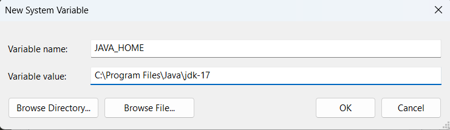

# Spark Installation On Windows
*This repository shows the spark installation procedures on a Windows Machine.*

---

## Download Java
1. Open any browser in your system and visit [Oracle](https://www.oracle.com/).
2. You might see the navbar on the website as follows:

(**Note: The UI could change in the future.**)
3. Click on Products and look for `Java` and click on it.

4. Then, you might the following page.

5. Then, you might the following page, by default it will ask you to download you the latest version, But I prefer to use old ones.

(**I suggest you to download like I did :)**)
6. So, Click on **Java Archive** and then scroll over and watchout for `Java SE 17 (17.0.12 and earlier)` and click it.
7. Then, scroll down and download the following version.


Thats it! You've download Java.

---

## Installing Java
1. Click the installer and install the application.
2. And store the files in the folder **Program Files** of `C drive`.
2. So, once you are done with the installation, the Java can be accessible at the location `C:\Program Files\Java\jdk-17` in your machine.

---

## Download Spark
1. Go to the following link: [Spark](https://spark.apache.org/downloads.html)
2. You might see the following page, just click on the download link

3. Then, just click on the folllwing download link


---

## Spark Folder Setup
1. At this moment, you would have downloaded the Spark.
2. Go on and Extract the downloaded folder.
3. Once extracted, you'll have the following folder

4. Go inside the this folder and you'll see the following contents.

5. Now copy this folder **spark-3.5.5-bin-hadoop3** and paste it in the C drive folder.
6. Now, rename this folder as **spark-3.5.5**
7. So, now you'll Spark can be accessible at the location `C:\spark-3.5.5` in your machine.

---
## Download Winutils
1. For this, see go to [Utils](utils/winutils.exe) and download it. (I'm using this for hadoop version 3.0.0)
You could have done this by [Winutils Github](https://github.com/steveloughran/winutils/tree/master/hadoop-3.0.0/bin) and downloaded the `winutils.exe`
---

## Hadoop Setup
1. Now create a folder named **hadoop** in your `C drive`.
2. Now, create a folder named **bin** inside the above folder.
3. Place the downloaded winutils file in the above location.
4. So, now you'll winutils file for hadoop, that can be accessible at the location `C:\hadoop\bin` in your machine.

---
## Setting System and path variables
1. Go to the settings or search for `System environments`, you'll see **Edit the system environment variables**.
2. Under **System variables**, add the following variables.

| Variable Name     | Path                             |
| ----------------- | -------------------------------- |
| **JAVA_HOME**     | **C:\Program Files\Java\jdk-17** |
| **SPARK_HOME**    | **C:\spark-3.5.5**               |
| **HADOOP_HOME**   | **C:\hadoop\bin**                |

3. For example as follows:


4. The, Under **System variables**, select the **Path** variable, and add the following
    - **%JAVA_HOME%\bin**
    - **%SPARK_HOME%\bin**
    - **%HADOOP_HOME%\bin**

---

## Checking Installations

##### Check Java Installation
- Open command prompt and enter the following command.
    ```bash
    java --version
    ```

##### Spark (Scala)
- Open command prompt and enter the following command.
    ```bash
    spark-shell
    ```

##### PySpark
- Open command prompt and enter the following command.
    ```bash
    pyspark
    ```
---
